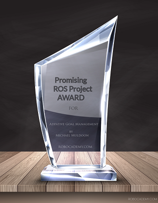

# Adaptive Goal Management #

My project was fortunate to be selected for recognition during my coursework with [Lentin Joesph](https://www.linkedin.com/in/lentinjoseph/).  You can check out his great course and books here: https://robocademy.com/

### Description ###

This repository is the documentation, examples, issue tracking for a MVP app I created called Adaptive Goal Management.

Adaptive Goal Managment is an app which acts as a robot fleet manager based upon an adaptive goal execution system for robots and drones which are connected to the internet.  

There are no limitations as to the number of robots which can be controlled using this system.  It was designed to be a high throughput system and handle hundreds of robots and users.

It is free to test and experiment with your robots and create your own fleet of the hardest working robots!  I am currently building out examples using ROS that are also free to use.

### Where to find the app and documentation ###

- [Adaptive Goal Management Website](https://adaptive-goal-management.herokuapp.com/): This is the website of the app. 
- [Documentation describing what it does and how it works](https://github.com/mukmalone/AdpativeGoalManagement/blob/master/documentation/Adaptive%20Goal%20Management-Overview.pdf): This is an overview of how the app works using a manufacturing example.
- [API documentation](https://github.com/mukmalone/AdpativeGoalManagement/blob/master/documentation/API_Documentation.md): This is the API documentation and the ROS service documentation which connects to the app.
- [Controlling your ROS robot using the web controls](https://github.com/mukmalone/AdaptiveGoalManagement/blob/master/documentation/ROS_Web_Control.md)

### Introduction ###

### Quick start guide ###

### Web Controls Introduction ###

### Examples ###
In the examples folder there are examples of robots based upon ROS and simulations using the application.

#### [Manufacturing: MIR Robot in ROS & AGM Fleet Manager Example](https://github.com/mukmalone/AdpativeGoalManagement/tree/master/examples/mir_robot) ####

- Step 1: Clone this project to your catkin workspace
- Step 2: Clone https://github.com/mukmalone/agm_msgs to your catkin workspace
- Step 3: Clone https://github.com/mukmalone/agm_comm to your catkin workspac
- Step 4: `catkin_make --pkg agm_msgs`
- Step 5: `catkin_make`
- Step 6: Configure your AGM workspace with one worker (see [Quickstart](https://www.youtube.com/watch?v=ex2v6yrXj6A&feature=youtu.be))
- Step 7: in `/mir_agm/launch/mir_agm.launch` modify the last node launched to have the arg equal to your Worker key:
- > `<node name="agm_worker_node" pkg="agm_comm" type="agm_worker_node" args="YOUR_WORKER_KEY_HERE"/>`
- Step 8: `roslaunch mir_agm mir_agm.launch`
- Step 9: Activate routings

### [Medical: MIR Robot in ROS Hospital Sterilization](https://github.com/mukmalone/AdpativeGoalManagement/tree/master/examples/mir_robot/mir_agm/launch) ###
- Step 1: Clone the project to your catkin workspace
- Step 2: `catkin_make`
- Step 3: Configure your AGM workspace with one worker (see [Quickstart](https://www.youtube.com/watch?v=ex2v6yrXj6A&feature=youtu.be))
- Step 4: in `/mir_agm/launch/mir_agm_hospital.launch` modify the last node launched to have the arg equal to your Worker key:
- > `<node name="agm_worker_node" pkg="mir_agm" type="agm_worker_node" args="YOUR_WORKER_KEY_HERE"/>`
- Step 5: `roslaunch mir_agm mir_agm_hospital.launch`
- Step 6: Activate routings you've created in AGM to sterilize the hospital setting.  You can use the path [creation ubuntu spreadsheet](https://github.com/mukmalone/AdpativeGoalManagement/blob/master/documentation/path_building_v1.ods) to find coordinates of locations in the [hospital map](https://github.com/mukmalone/AdpativeGoalManagement/tree/master/examples/mir_robot/mir_agm/maps)

